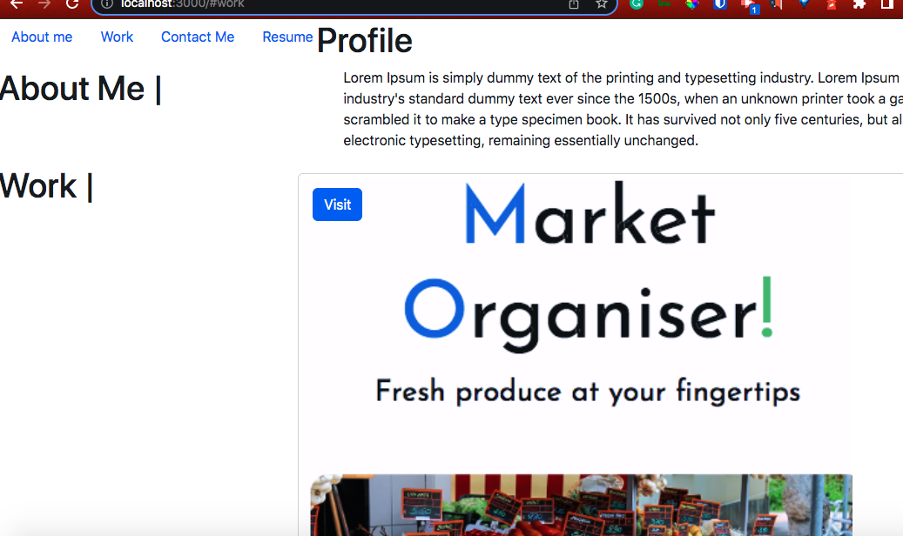

# react-portfolio

## Acceptance Criteria

```md
GIVEN a single-page application portfolio for a web developer
WHEN you load the portfolio
THEN you will be presented with a page containing a header, a section for content, and a footer
WHEN you view the header
THEN you will be presented with the developer's name and navigation with titles corresponding to different sections of the portfolio
WHEN you view the navigation titles
THEN you will be presented with the titles About Me, Portfolio, Contact, and Resume, and the title corresponding to the current section is highlighted
WHEN you click on a navigation title
THEN I am presented with the corresponding section below the navigation without the page reloading and that title is highlighted
WHEN you load the portfolio the first time
THEN the About Me title and section are selected by default
WHEN you will be presented with the About Me section
THEN you will see a recent photo or avatar of the developer and a short bio about them
WHEN you will be presented with the Portfolio section
THEN you will see titled images of six of the developer’s applications with links to both the deployed applications and the corresponding GitHub repositories
WHEN you will be  presented with the Contact section
THEN you will see a contact form with fields for a name, an email address, and a WHEN you will be presented with the Resume section
THEN you will see a link to a downloadable resume and a list of the developer’s proficiencies
WHEN you view the footer
THEN you will be presented with text or icon links to the developer’s GitHub and LinkedIn profiles, and their profile on a third platform (Stack Overflow, Twitter)
```

## Mock-Up

The following animation shows the web application's appearance and functionality:



- - -
© Nancy S.

